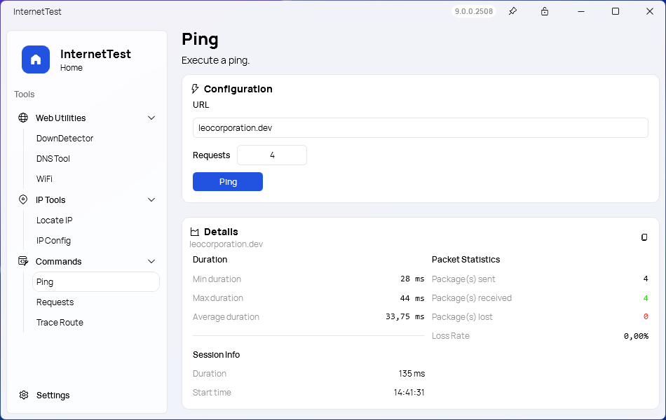
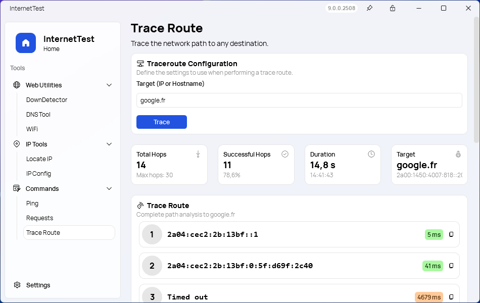

 

  

  <h1 align="center">InternetTest</h3>

  

    Taking you to another level.  InternetTest can locate IP addresses, send ping request, recover your WiFi passwords and more!
     
    <a href="https://tinyurl.com/DownloadITP7"><strong>Download »</strong></a>
     
    <a href="https://github.com/Leo-Corporation/InternetTest/issues/new?assignees=&labels=bug&template=bug-report.yml&title=%5BBug%5D+">Report Bug</a>
    ·
    <a href="https://github.com/Leo-Corporation/InternetTest/issues/new?assignees=&labels=enhancement&template=feature-request.yml&title=%5BEnhancement%5D+">Request Feature</a>
    ·
    <a href="https://github.com/Leo-Corporation/InternetTest/releases">Releases</a>

  

## Introduction

<picture>
  <source srcset=".github/images/banner2.png" media="(prefers-color-scheme: dark)"          />
    
</picture>

InternetTest Pro - Your Windows connection toolkit. Monitor, diagnose, and optimize internet connectivity with ease. Empowering users with actionable insights, from network diagnostics to WiFi password recovery. Seamlessly enhance your online experience anytime, anywhere.

✨ **New:** Introducing [InternetTest CLI](https://github.com/Leo-Corporation/InternetTestCLI), a command line interface that provides the same features of InternetTest Pro.

## Features

InternetTest Pro is a powerful and modern connection utility designed for Windows users. With its comprehensive set of features, InternetTest Pro empowers you to monitor and optimize your internet connection experience. Here are some of the key features:

### Check Internet Connection

Easily determine whether your Windows device is currently connected to the internet. InternetTest Pro provides a quick and accurate way to assess your online status.

### Perform Speed Test

Measure your internet connection's speed with precision using the built-in speed test feature. Understand your download speed to ensure you're getting the performance you expect from your service provider.

### Website Availability Check

Verify the availability of websites in real-time. InternetTest Pro allows you to check whether specific websites are up or down, helping you identify potential network or website issues.

### DNS Information Retrieval

Retrieve DNS information for a domain using the DNS lookup feature. Similar to the `dig` command, InternetTest Pro provides detailed DNS records for domains, enabling you to diagnose and troubleshoot network-related problems.

### Nearby WiFi Network Information

Discover nearby WiFi networks and gather essential information about them. InternetTest Pro provides insights into available networks, aiding in the selection of the most suitable and stable connection.

### IP Address Display

The "IP Address Display" feature in InternetTest Pro provides you with an immediate and straightforward way to access your device's current IP address. Your device's IP address is a fundamental identifier used to communicate on a network.

### IP and URL Geolocation

<picture>
  <source srcset=".github/images/screens/2B.png" media="(prefers-color-scheme: dark)"          />
    
</picture>
The "IP and URL Geolocation" feature in InternetTest Pro enhances your understanding of network routing and the physical locations of servers or websites. This functionality allows you to:

- **Geographical Context:** Discover the approximate physical location of an IP address or URL. This information provides geographical context, which is essential for understanding where network resources are located in the world.

- **Network Diagnostics:** Geolocation data can be crucial for diagnosing issues related to content delivery or latency. If you're experiencing slow loading times for a website, knowing the server's location can help identify if distance plays a role.

- **Security Awareness:** Geolocation can also offer insights into potential security threats. If you detect unexpected or suspicious IP addresses from certain locations, it could indicate unauthorized access attempts or compromised resources.

### Ping Functionality

<picture>
  <source srcset=".github/images/screens/4B.png" media="(prefers-color-scheme: dark)"          />
    
</picture>
Conduct ping tests to measure the latency and responsiveness of IPs or URLs. InternetTest Pro's ping feature helps you evaluate network performance and identify potential bottlenecks.

### IP Configuration Details

<picture>
  <source srcset=".github/images/screens/6B.png" media="(prefers-color-scheme: dark)"          />
    
</picture>
Retrieve detailed IP configuration information using the IPConfig feature. Similar to the `ipconfig` command in Windows, InternetTest Pro provides a comprehensive overview of your device's network settings.

### Traceroute Functionality

<picture>
  <source srcset=".github/images/screens/5B.png" media="(prefers-color-scheme: dark)"          />
    
</picture>
InternetTest Pro includes a traceroute feature that enables you to trace the path your data takes through the network from your device to a target IP address or URL. This feature helps you understand the network routing and identify potential points of congestion or delays. With InternetTest Pro's traceroute functionality, you can:

- **Trace Network Hops:** Obtain a detailed list of intermediate routers or hops that your data traverses on its way to the destination.
- **View IP Addresses:** For each hop, InternetTest Pro displays the corresponding IP address, allowing you to analyze the routing path and identify any unexpected detours.

- **Evaluate Latency:** Measure the round-trip time (latency) for each hop, helping you identify potential bottlenecks or areas of network congestion.

- **Identify Network Issues:** Detect issues such as packet loss or excessively long latency at specific hops, aiding in troubleshooting connectivity problems.

The traceroute functionality in InternetTest Pro provides valuable insights into the network's structure and performance, enabling you to optimize your network connections and diagnose issues effectively.

### WiFi Password Recovery

<picture>
  <source srcset=".github/images/screens/3B.png" media="(prefers-color-scheme: dark)"          />
    
</picture>
The "WiFi Password Recovery" feature in InternetTest Pro offers a convenient and secure way to retrieve stored WiFi passwords for networks that your device has previously connected to. This capability can be incredibly useful in various scenarios:

- **Forgotten Passwords:** If you've forgotten the password for a WiFi network you previously connected to, InternetTest Pro can help you recover it. This is especially handy if you have numerous devices connected and can't easily access the password.

- **New Devices:** When you're setting up a new device, having the ability to retrieve previously saved WiFi passwords ensures a smooth setup process; you can retrieve your passwords from your old computer.

- **Sharing Networks:** If you want to share a network's password with a friend or family member, this feature allows you to easily retrieve the password without the need to access the router's settings.

InternetTest Pro brings together a comprehensive suite of tools to empower Windows users with detailed insights into their internet connection and network environment. Whether you're troubleshooting connectivity issues or optimizing your online experience, InternetTest Pro has you covered.

### WiFi Networks

The WiFi Networks feature in InternetTest Pro empowers users with a comprehensive set of tools to manage and optimize their wireless network connections. Whether you're seeking information about nearby networks or fine-tuning your network adapters, this section provides you with the functionality you need.

#### 1. WiFi Networks Section

- **Discover Available Nearby Networks**:
  InternetTest Pro allows you to access detailed information about nearby WiFi networks, including speed, signal strength, band, frequency, and more. Make informed decisions about which network to connect to, ensuring a seamless online experience.

- **Connect to WiFi Networks** (no password needed for networks you previously connected to)
- **WiFi Network Scanning**:
  Stay up-to-date with the latest information on nearby WiFi networks. Launch a scan to refresh the list of available networks, ensuring you always have access to the most accurate and current data.

#### 2. Network Adapters Section

- **Obtain Available Network Adapters**:
  Get all available network adapters on your system, along with essential information such as their status, interface type, speed, and total bytes received and sent. This knowledge allows you to troubleshoot network issues effectively.

- **Detailed Adapter Information**: Access detailed insights, including configuration details, statistics, and performance metrics.

The WiFi Networks feature in InternetTest Pro puts you in control of your wireless connections and network adapters, empowering you to make informed decisions, troubleshoot issues, and ensure a smooth online experience.

## Customization and User Experience

InternetTest Pro offers a range of customization features that fit to your unique preferences and needs. These features are designed to enhance your overall user experience and adapt the utility to fit your specific requirements.

### Customized Dashboard ([Synethia](https://github.com/DevyusCode/Synethia))

<picture>
  <source srcset=".github/images/screens/1B.png" media="(prefers-color-scheme: dark)"          />
    
</picture>
Experience a dashboard tailored to your usage patterns with the innovative Synethia feature. InternetTest Pro intelligently analyzes your interactions and prioritizes the tools you use most frequently. This means that your most-used features are conveniently placed front and center, allowing for a faster and more efficient workflow.

### Dark Mode

InternetTest Pro offers a modern and stylish Dark Mode option. This not only provides a sleek aesthetic but also reduces eye strain during nighttime usage. Switching to Dark Mode enhances your comfort and ensures a visually appealing experience, even in low-light environments.

### Automatic Update System

Stay up-to-date effortlessly with InternetTest Pro's automatic update system. You'll receive the latest enhancements, features, and security improvements without manual intervention. This ensures that you're always using the most reliable and feature-rich version of the utility.

### Settings Customization

Tailor InternetTest Pro to your preferences through extensive settings customization. Adjust notification preferences to receive alerts in a manner that suits you. Set behaviors for when the utility starts up to align with your workflow. Define default protocols to streamline your testing and diagnostics processes.

### Confidential Mode

Protect your sensitive information with the Confidential Mode feature. When enabled, InternetTest Pro intelligently conceals confidential data such as IP addresses and SSIDs. This ensures that your private information remains hidden from prying eyes, enhancing your security and peace of mind.

### Multiple Languages

InternetTest Pro has support for multiple languages. These languages are currently available:

- English (United States)
- French (France)
- Simplified Chinese (People's Republic of China)
- Italian (Italy)

Customization lies at the heart of InternetTest Pro's design, empowering you to shape your experience according to your preferences. Whether you prioritize convenience, aesthetics, privacy, or localization, InternetTest Pro adapts to your needs, making it a versatile and user-centric utility.

[Click here](https://blog.leocorporation.dev/2022/08/introducing-internettest-pro/) to learn more about InternetTest Pro.

## Compatibility

InternetTest Pro is available only on Windows from Windows 7 to 11. For legacy platforms, you may need to install the [.NET Desktop SDK](https://dotnet.microsoft.com/en-us/download) manually.

## Latest release

[Click here](https://github.com/Leo-Corporation/InternetTest/releases) to show the latest release's changelog.

## Contributing

Thank you for considering contributing to InternetTest Pro! We welcome contributions from the community to help us improve and enhance this utility.

Before you begin, please take a moment to review our [Contribution Guidelines](CONTRIBUTING.md) to understand our process and expectations. These guidelines cover various aspects of contributing, including reporting issues, suggesting new features, and submitting code changes.

### Requirements

Before you begin contributing to InternetTest Pro, ensure that you have the following prerequisites installed:

- Visual Studio 2022 v17.0 or higher
  - .NET Desktop Development (to select in Visual Studio installer)
- .NET SDK + .NET SDK Desktop
- Git
- .NET 6
- _(Optional)_ Inno Setup v6.1 or higher (for building installers)

These tools and software components are essential for building, testing, and contributing to InternetTest Pro effectively. Make sure to have them set up on your development environment before proceeding with any contributions.

### How to Contribute

1. **Check for Issues:** Before starting work on a new feature or bug fix, check the [issue tracker](https://github.com/Leo-Corporation/InternetTest/issues) to see if it has already been reported or is being worked on.

2. **Fork the Repository:** If you plan to contribute, fork the InternetTest Pro repository to your GitHub account.

3. **Create a Branch:** Create a new branch in your forked repository for your work. Choose a descriptive name that reflects the purpose of your contribution.

4. **Make Changes:** Make your changes or additions in your branch. Be sure to follow the coding style and guidelines outlined in our [Contributor Guidelines](CONTRIBUTING.md).

5. **Testing:** Test your changes thoroughly to ensure they don't introduce any unintended side effects.

6. **Submit a Pull Request:** When you're confident in your changes, submit a pull request to the main InternetTest Pro repository. Be sure to provide a clear and concise explanation of your changes and the problem they address.

### Code of Conduct

Please note that by contributing to InternetTest Pro, you are expected to follow our [Code of Conduct](CODE_OF_CONDUCT.md). This ensures a respectful and inclusive environment for everyone involved in the project.

We appreciate your contributions and look forward to working together to improve InternetTest Pro for the community. Your input helps us make the utility better and more effective for users worldwide.

For more detailed information on how to contribute, refer to our [Contribution Guidelines](CONTRIBUTING.md).

Thank you for being part of the InternetTest Pro community!

## Branches

This Git repo has always two branches:

|  Name   |                                                                       Release                                                                       |               Description               |
| :-----: | :-------------------------------------------------------------------------------------------------------------------------------------------------: | :-------------------------------------: |
| `main`  |                                             |             Stable versions             |
| `vNext` |  | Next version of InternetTest (unstable) |

> Note: Other branches can also - of course - exists.

## License

This project is under the [MIT License](https://github.com/Leo-Corporation/InternetTest/blob/main/LICENSE).
